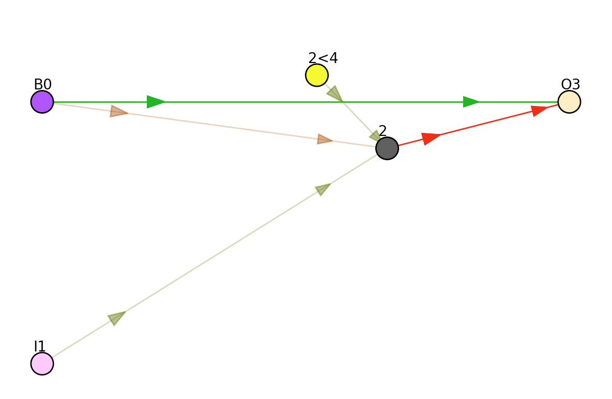
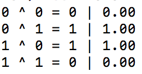
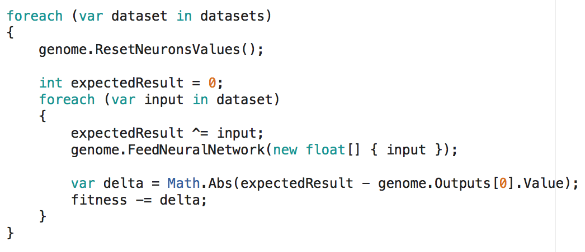

# Testing RNNs on XOR 1-input model with Neural Nets and GA

**The network**

  * B0 - bias
  * I1 - input
  * 2<4 - *recurrent connection* of neuron **2**
  * 2 - hidden neuron
  * O3 - output

The recurrent connections in this project are explicitly separated in a different neuron. In the network above, the *yellow* neuron was added for the connection: **2 -> 2**. Before each neural computation, the *memory neurons* get the value of their targets neurons. In this case, the **4th** neuron (yellow), receives the value of the **2nd** neuron.

The hidden neuron (2) has a *Gaussian* activation function.

**Results**

This project was inspired from the [OpenAI Warmups exercises](https://blog.openai.com/requests-for-research-2/).

The agents are trained as the link suggests, the only difference it's that it uses only 100 instead of 100000 datasets.

